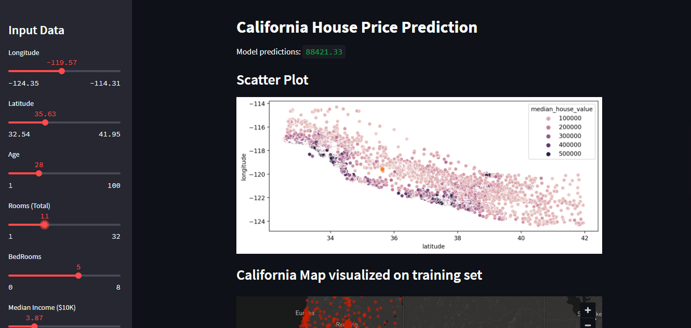
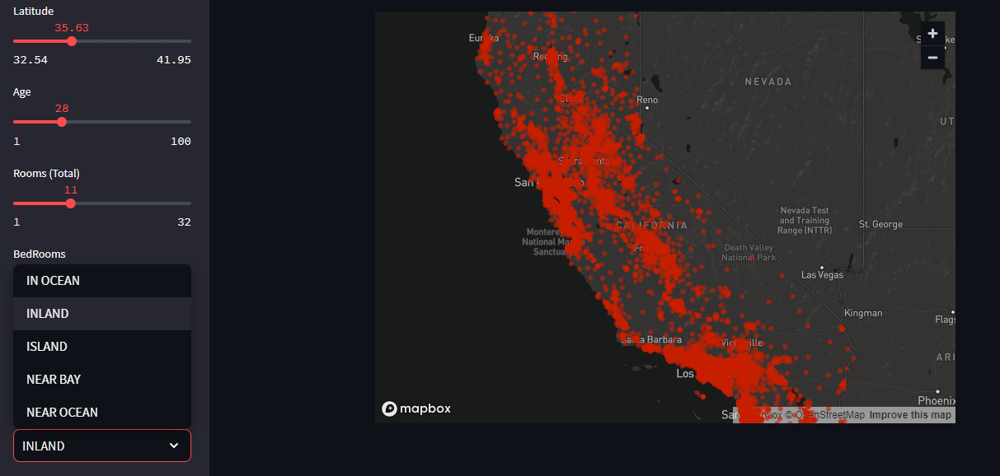

### California House Price Prediction (Regression).
Retrieved from [Kaggle](https://www.kaggle.com/datasets/shibumohapatra/house-price)

---

This project predicts house prices in California using RandomForest. It provides a Streamlit web application interface where users can input property details, such as longitude, latitude, age, total rooms, bedrooms, and median income, to get a predicted house price.

## Setup

1. Clone the repository.
2. Go to the project directory
3. Run the Streamlit application with `streamlit run app.py`.
4. Access the application in your web browser at `http://localhost:8501`.

## Usage

1. Open the web application in your browser.
2. Adjust the sliders to input property details.
3. The model will predict the house price based on the given inputs.
4. The California map visualizes the training set, highlighting the predicted property location.

## Screenshots

Feel free to explore and interact with the application to predict house prices in California.
